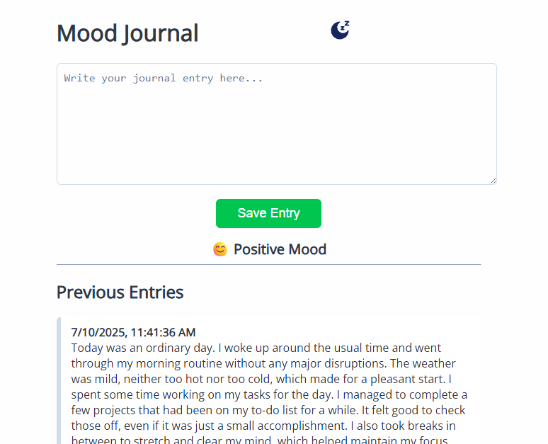

# Mood Journal with Sentiment Analysis

This is a simple web app that lets users write daily journal entries and analyzes the mood using basic sentiment analysis.

## Features

- Write journal entries.
- Sentiment analysis (positive, neutral, negative) using keyword matching.
- Display mood and mood history.
- Entries saved in localStorage.
- Responsive and clean UI.

## Optional Next Steps

- Use advanced sentiment analysis libraries or APIs.
- Add calendar view for entries.
- Edit/delete functionality.
- Dark mode toggle.
- Backend storage and user authentication.
- Mood-based background images.
- Export/import entries.
- Mood trend visualization.

---

## 📸 Screenshot



---

## 🚀 How to Run

### 1. Clone the repository or download the files.

```bash
git clone https://github.com/Nomahk25/mood-journal.git
cd mood-journal
```

### 2. Simply open index.html in a modern browser:

open index.html
Or double-click the file if you're not using terminal.

## 👤 Author

Nomanguni Khumalo
📍 Johannesburg, South Africa

## 💡 Inspiration

This project was inspired by the idea of combining mental health journaling with simple AI tools to give users insights into their emotional patterns—without needing a complex backend or setup.

## 🤝 Contributing

Feel free to fork the project, improve it, and submit pull requests!

Ideas:
- Replace basic sentiment matching with real NLP models
- Add a login system for multiple users
- Connect to a mood-based music playlist
- Generate motivational quotes based on mood

## 📜 License

This project is open source and available under the MIT License.
